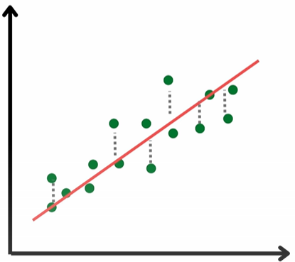
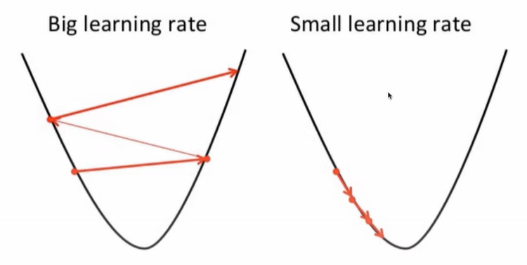

# Basic Linear Regression Algorithm
This repo explores the basics of Linear Regression algorithm from scratch. Enjoy!

### Software, Tools, and prerequisits
1. Access to Google Colab or some Jupyter Notebook.
2. Basic python programing.
3. Basic arithmetic & calculus knowledge

### Intro: What is Linear Regression?
This deals with understanding the pattern/ slope of a given dataset given the assumption that the dataset has a linear pattern. Basically predicting the value of a variable based off the value of another variable.

Given a formulars, 
1. Equation of a line:
$$\hat{y} = wx + b$$
2. Mean Squared Error $(MSE)$, also happens to be the cost function:
$$MSE = \frac{1}{N} \Sigma_{i=1}^n({y}-\hat{y})^2$$ 
$$J(w,b) = \frac{1}{N} \Sigma_{i=1}^n({y}- (w_{i}x + b))^2$$
3. and the derivitive of the cost function, with respect to both the weight and bias respectively:  
$$\frac{dJ}{dw} = \frac{1}{N} \Sigma-2x_{i}({y}- (w_{i}x + b))^2$$
$$\frac{dJ}{db} = \frac{1}{N} \Sigma-2({y}- (w_{i}x + b))^2$$

The derivitive (negative graidient) of the cost functions tells us which direction to go to minimize the loss/ cost function which happens to be the $MSE$ in this example.

With each itiration, we have an update rule for the new weight & bias to minimize the cost function and this update rule is given by:
$$w = w + \alpha . dw$$
$$b = w + \alpha . db$$
where $\alpha$ is the selected learning rate which tells us how fast or slow to go in the direction of gradient. This needs to be optimal as too big or too small learning rates can lead to non convergence to the global minimum error.

